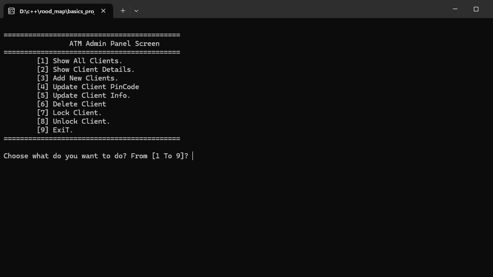
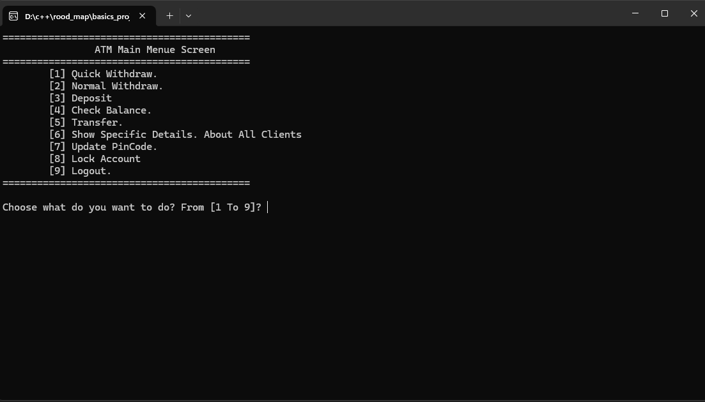
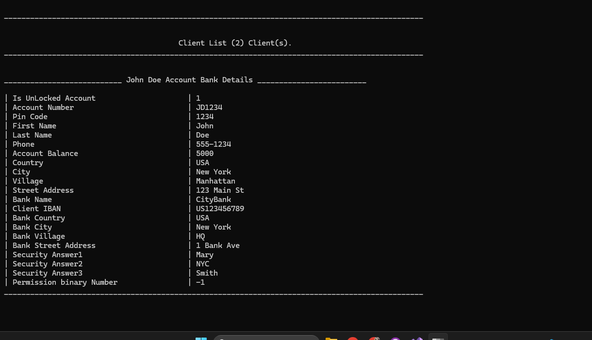
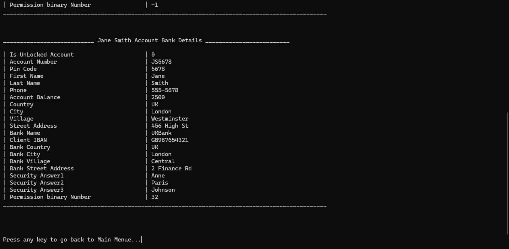

# ATM-System-v1
Simple C++ ATM project
# 🏧 ATM System in C++

A comprehensive console-based ATM simulator with banking features, admin controls, and file-based data storage.

## 🔐 LogIn Section

## 🌟 Key Features

### 👨‍💼 Admin Features
- 👥 Full client management:
  - Add/delete client accounts
  - Modify account details
  - Lock/unlock accounts
- 🔧 System configuration:
  - Set transaction permissions
  - View all client records
- 📁 Database management:
  - File-based storage (`Clients.txt`)
  - Data backup/restore

### 👤 User Features
- 🔐 Secure PIN-based authentication
- 💰 Transaction operations:
  - Quick cash withdrawal ($20-$1000)
  - Custom withdrawal amounts
  - Cash deposits
  - Balance inquiries
- 📊 Transaction history
- 🔄 Fund transfers between accounts
- 🛡️ Self-service account locking

## 📂 Project Structure

⚠️ **Note**: All data in `Clients.txt` is fake for testing.
